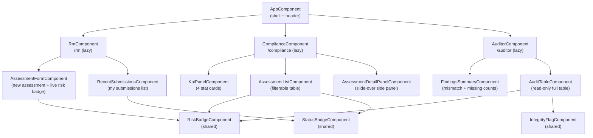
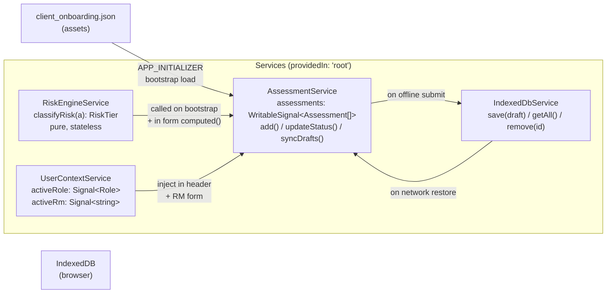
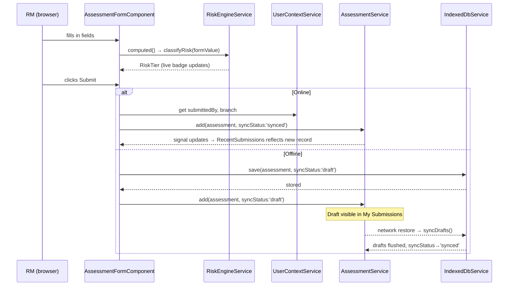
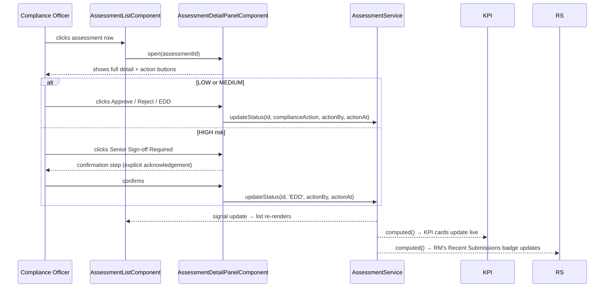

# SENTINEL Prototype — Angular Architecture

---

## 1. High-Level Layered Architecture

```
┌─────────────────────────────────────────────────────────────────┐
│                        BROWSER                                  │
│                                                                 │
│  ┌───────────────────────────────────────────────────────────┐  │
│  │                    APP SHELL                              │  │
│  │   AppComponent  ·  Header (role switcher, RM selector)   │  │
│  │   RouterOutlet  ·  AppConfig  ·  AppRoutes               │  │
│  └────────────────────────┬──────────────────────────────────┘  │
│                           │ lazy routes                         │
│         ┌─────────────────┼──────────────────┐                  │
│         ▼                 ▼                  ▼                  │
│  ┌─────────────┐  ┌──────────────┐  ┌──────────────┐           │
│  │  RM Feature │  │ Compliance   │  │ Auditor      │           │
│  │  /rm        │  │ Feature      │  │ Feature      │           │
│  │             │  │ /compliance  │  │ /auditor     │           │
│  └──────┬──────┘  └──────┬───────┘  └──────┬───────┘           │
│         │                │                 │                    │
│         └────────────────┴─────────────────┘                    │
│                          │ inject()                             │
│  ┌───────────────────────▼───────────────────────────────────┐  │
│  │                   SERVICES LAYER                          │  │
│  │                                                           │  │
│  │   AssessmentService      RiskEngineService                │  │
│  │   WritableSignal<        classifyRisk()                   │  │
│  │   Assessment[]>          pure function                    │  │
│  │                                                           │  │
│  │   IndexedDbService       UserContextService               │  │
│  │   draft storage          active role + RM name            │  │
│  └───────────────────────┬───────────────────────────────────┘  │
│                          │                                      │
│  ┌───────────────────────▼───────────────────────────────────┐  │
│  │                    DATA LAYER                             │  │
│  │                                                           │  │
│  │   assets/data/                  IndexedDB                 │  │
│  │   client_onboarding.json        (offline drafts)          │  │
│  │   (bootstrapped on app init)                              │  │
│  └───────────────────────────────────────────────────────────┘  │
└─────────────────────────────────────────────────────────────────┘
```

---

## 2. Component Tree



---

## 3. Services & State



---

## 4. Data Flow — New Assessment Submission



---

## 5. Data Flow — Compliance Action



---

## 6. Offline Sync State Machine

```
         submit()
[FORM] ──────────────► [SYNCED]
           online

         submit()
[FORM] ──────────────► [DRAFT]
           offline          │
                            │ network restore
                            ▼
                    [PENDING_SYNC]
                            │
                            │ syncDrafts() completes
                            ▼
                        [SYNCED]
```

---

## 7. File Structure

```
src/
├── app/
│   ├── app.ts                        # App shell component
│   ├── app.html
│   ├── app.config.ts                 # provideRouter, APP_INITIALIZER
│   ├── app.routes.ts                 # lazy route definitions
│   │
│   ├── features/
│   │   ├── rm/
│   │   │   ├── rm.routes.ts
│   │   │   ├── rm.component.ts
│   │   │   ├── assessment-form/
│   │   │   │   └── assessment-form.component.ts
│   │   │   └── recent-submissions/
│   │   │       └── recent-submissions.component.ts
│   │   │
│   │   ├── compliance/
│   │   │   ├── compliance.routes.ts
│   │   │   ├── compliance.component.ts
│   │   │   ├── kpi-panel/
│   │   │   │   └── kpi-panel.component.ts
│   │   │   ├── assessment-list/
│   │   │   │   └── assessment-list.component.ts
│   │   │   └── assessment-detail-panel/
│   │   │       └── assessment-detail-panel.component.ts
│   │   │
│   │   └── auditor/
│   │       ├── auditor.routes.ts
│   │       ├── auditor.component.ts
│   │       ├── findings-summary/
│   │       │   └── findings-summary.component.ts
│   │       └── audit-table/
│   │           └── audit-table.component.ts
│   │
│   ├── shared/
│   │   └── components/
│   │       ├── risk-badge/
│   │       ├── status-badge/
│   │       └── integrity-flag/
│   │
│   └── core/
│       ├── models/
│       │   └── assessment.model.ts   # Assessment interface + enums
│       └── services/
│           ├── assessment.service.ts
│           ├── risk-engine.service.ts
│           ├── indexed-db.service.ts
│           └── user-context.service.ts
│
└── assets/
    └── data/
        └── client_onboarding.json    # converted from CSV
```

---

## 8. Key Angular Patterns Used

| Pattern                          | Where                                                         |
| -------------------------------- | ------------------------------------------------------------- |
| `WritableSignal`                 | `AssessmentService` — source of truth for all records         |
| `computed()`                     | Risk badge in form, KPI cards, filtered list views            |
| `APP_INITIALIZER`                | Load JSON + bootstrap `AssessmentService` before first render |
| Lazy loading                     | All 3 feature routes                                          |
| `ChangeDetectionStrategy.OnPush` | All components                                                |
| `inject()`                       | Service injection in all components                           |
| `input()` / `output()`           | All shared components                                         |
| Reactive Forms                   | Assessment intake form with validators                        |
| Native control flow              | `@if`, `@for`, `@switch` throughout templates                 |
